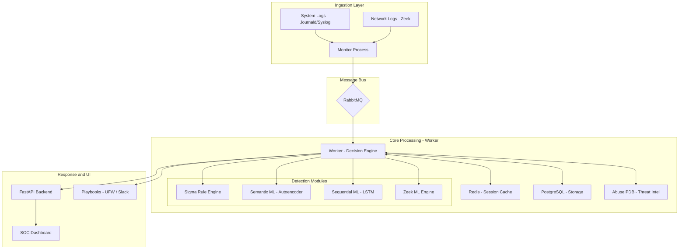

# LogRKSha -- Log Anomaly Detection System

A production-grade, hybrid machine learning SIEM built to detect known threats and unknown behavioral anomalies in real-time. Designed to function as the analytical core of a Security Operations Center, LogRKSha unifies system logs (Syslog/Journald) and network logs (Zeek) into a single analysis pipeline, enriched with threat intelligence, automated response playbooks, and generative AI-assisted investigation.

<p align="center">
  
  
  
  
  
  
  <a href="LICENSE"></a>
</p>

---

## Table of Contents

- [Overview](#overview)
- [Architecture](#architecture)
- [Features](#features)
  - [Detection Engine](#detection-engine)
  - [Dashboard and Visualization](#dashboard-and-visualization)
  - [SOAR and Playbooks](#soar-and-playbooks)
  - [Case Management](#case-management)
  - [Generative AI Integration](#generative-ai-integration)
  - [Threat Intelligence and Enrichment](#threat-intelligence-and-enrichment)
  - [Authentication and Access Control](#authentication-and-access-control)
  - [Honeytoken Deception](#honeytoken-deception)
  - [Log Review System](#log-review-system)
- [Technology Stack](#technology-stack)
- [Project Structure](#project-structure)
- [Prerequisites](#prerequisites)
- [Installation](#installation)
- [Configuration](#configuration)
- [Usage](#usage)
- [Testing and Simulation](#testing-and-simulation)
- [Research and Baselines](#research-and-baselines)
- [Contributing](#contributing)
- [License](#license)

---

## Overview

Traditional SIEMs rely on static rule sets -- they catch what you already know to look for, and nothing else. LogRKSha addresses this gap by combining rule-based detection with multiple machine learning models, each targeting a different class of threat:

- A **semantic model** (SentenceTransformer) that understands the meaning of log lines, not just keywords.
- An **unsupervised autoencoder** that flags novel patterns by measuring reconstruction error -- designed to catch zero-day activity that no rule would match.
- A **sequential LSTM** that tracks user and session behavior over time, detecting impossible sequences and abnormal flows.
- A **Sigma rule engine** that provides immediate coverage for known threat signatures using the industry-standard YAML format.
- A **specialized Zeek network engine** with protocol-specific heuristics for DNS, HTTP, SSL, and connection analysis.

Every detection result is enriched with MITRE ATT&CK mapping, threat intelligence lookups, and explainable AI output (LIME), giving analysts the context they need to make fast decisions.


---

## Architecture

The system uses a decoupled, asynchronous architecture. A monitor process tails log sources and pushes lines into RabbitMQ. A worker process consumes from the queue, runs the full detection pipeline, stores results in PostgreSQL, and triggers automated responses. The FastAPI backend serves the analyst dashboard and API, with live updates over WebSockets.



---

## Features

### Detection Engine

LogRKSha runs every log line through multiple detection layers in parallel:

**Semantic Analysis (SentenceTransformer + SGD Classifier)**
Converts log lines into dense vector embeddings using a BERT-based sentence transformer. An SGD classifier trained on labeled data provides supervised anomaly classification. The system also tracks per-log risk scores derived from prediction confidence.

**Unsupervised Anomaly Detection (Autoencoder)**
A TensorFlow/Keras autoencoder learns the "normal" distribution of log embeddings during training. At inference, logs that produce high reconstruction error -- meaning the model has never seen anything like them -- are flagged as anomalies. This is the primary mechanism for zero-day detection.

**Behavioral Sequence Analysis (LSTM)**
Maintains rolling 20-step session windows in Redis, keyed by IP address, username, or process ID. An LSTM model evaluates whether the current sequence of actions is consistent with historical patterns. Catches lateral movement, privilege escalation sequences, and brute-force attempts that appear normal in isolation.

**Sigma Rule Engine**
A custom rule engine that loads, parses, and matches Sigma rules (YAML format) against incoming logs. Supports custom rules with priority loading, keyword extraction from detection blocks, field-level conditions, and category tagging. Rules are organized by platform: Linux, Network, and Web.

```yaml
# Example: Custom Sigma rule for SSH brute force detection
title: SSH Brute Force Attempt
status: stable
level: high
detection:
  selection:
    - "Failed password"
    - "authentication failure"
  condition: selection
```

**Zeek Network Analysis Engine**
A dedicated 746-line ML engine (`zeek_ml_engine.py`) with specialized analyzers per protocol:

| Protocol | Analysis Capabilities |
|:--|:--|
| DNS | DGA detection via Shannon entropy, query length analysis, suspicious TLD identification |
| Connection | Port scan detection, long-duration connection flagging, connection state scoring |
| HTTP | SQL injection patterns, XSS detection, path traversal checks, suspicious user-agent scoring |
| SSL | Expired certificate detection, weak cipher identification, self-signed cert flagging |
| Alert Logs | Zeek's own weird.log and notice.log parsing with risk scoring |

**MITRE ATT&CK Mapping**
Every detected anomaly is automatically mapped against MITRE ATT&CK tactics and techniques using regex-based pattern matching. Results include tactic ID, technique name, and rule description, displayed directly in the dashboard.

**Explainable AI (LIME)**
Integrated LIME (Local Interpretable Model-agnostic Explanations) generates per-log feature importance breakdowns, rendered as visual bar charts in the dashboard. Analysts can see exactly which tokens in a log line contributed to the anomaly classification.


---

### Dashboard and Visualization

The analyst dashboard is a single-page application built with vanilla JavaScript (ES6 modules) and served by FastAPI.

- **Real-time log feed** via WebSocket streaming -- new detections appear instantly
- **Geographic threat map** using Leaflet and MaxMind GeoIP data, plotting attack origins on an interactive world map
- **Alert management panel** with status transitions (New, Acknowledged, Closed), analyst notes, and case linking
- **Interactive charts** (Chart.js): historical trend analysis, alert severity breakdowns, session risk scoring, model drift detection
- **Log search** with full-text and field-based filtering, backed by PostgreSQL (with optional Elasticsearch integration)
- **Training statistics** display showing model performance metrics over time
- **Model retraining** trigger directly from the dashboard (admin only)


---

### SOAR and Playbooks

Automated response playbooks execute defensive actions when alert conditions are met, without analyst intervention.

**Supported actions:**
- `block_ip_ufw` -- Block malicious IPs at the firewall level with configurable duration
- `send_slack_alert` -- Real-time notifications to SOC team channels via webhook
- `send_email_alert` -- Email notifications with configurable recipients
- `create_case` -- Automatically create investigation cases from high-severity alerts
- `run_script` -- Execute custom response scripts

**Playbook definition** uses JSON trigger conditions with support for operators (`>=`, `<=`, `==`, `!=`, `contains`, `regex`):

```json
{
  "name": "Block High-Risk External IPs",
  "trigger_conditions": {
    "risk_score": {"operator": ">=", "value": 0.85}
  },
  "actions": [
    {"action": "block_ip_ufw", "duration_hours": 24},
    {"action": "send_slack_alert", "channel": "#soc-critical"}
  ],
  "is_active": true
}
```

**LLM-powered playbook generation**: Describe the desired behavior in natural language, and the system generates a structured playbook configuration using the integrated LLM service.

Playbook execution history is logged with timestamps, actions taken, and success/failure status.


---

### Case Management

Investigation cases group related alerts into a single tracked unit. Features include:

- Full CRUD operations (create, view, update, close, delete)
- Alert linking and unlinking -- associate multiple alerts to a single investigation
- Priority levels: Low, Medium, High, Critical
- Status workflow: Open, In Progress, Resolved, Closed
- Assignment to specific analysts
- Audit trail on all case actions

---

### Generative AI Integration

LogRKSha integrates with multiple LLM providers for AI-assisted investigation. The system implements automatic failover -- if one provider is rate-limited or unavailable, it transparently switches to the next configured provider.

**Supported providers:** Gemini, Groq, Mistral, OpenRouter, Together AI, Ollama (local)

**Capabilities:**
- **Incident summarization** -- Generate executive summaries of alert clusters
- **Trend analysis** -- Natural language explanation of anomaly spikes in historical data
- **Remediation suggestions** -- Context-aware response steps based on the specific alert, threat intel, and MITRE mapping
- **Playbook generation** -- Convert natural language descriptions into structured JSON playbooks

Provider health is tracked with rate-limit cooldowns, and responses are cached in Redis to minimize API calls. See [LLM_SETUP.md](LLM_SETUP.md) for API key configuration.

---

### Threat Intelligence and Enrichment

- **AbuseIPDB integration**: Real-time IP reputation checks with Redis caching to minimize external API calls and latency
- **Threat intel data** is stored alongside each log entry and displayed in the dashboard, including abuse confidence scores and ISP/country data
- **GeoIP resolution**: MaxMind GeoIP2 database for geographic mapping of source and destination IPs

---

### Authentication and Access Control

- **JWT-based authentication** with HTTP-only secure cookies
- **Two-factor authentication (TOTP)** with QR code enrollment (compatible with Google Authenticator, Authy, etc.)
- **Role-based access control**: Admin and Analyst roles with endpoint-level permission enforcement
- **Rate limiting** on authentication endpoints and sensitive operations
- **Audit logging**: Every user action (login, alert update, case creation, playbook modification) is recorded in the `audit_logs` table with timestamps, IP addresses, and outcome

---

### Honeytoken Deception

Deploy decoy credentials (AWS keys, database credentials, API tokens) into monitored log paths. The worker process continuously scans incoming logs for honeytoken triggers. When a honeytoken is accessed:

- The trigger count is incremented
- A high-severity alert is generated
- Associated playbooks are executed (if configured)

Honeytokens are managed through the security dashboard with full create/delete/status controls.

---

### Log Review System

The review system supports two workflows for refining model accuracy:

**Cluster-based bulk review**: DBSCAN clustering groups similar logs together. Analysts can label an entire cluster at once (normal/anomalous), which bulk-updates all contained logs. Clusters are sorted by size, representative log, and first/last seen timestamps.

**Manual log-by-log review**: Individual logs can be reviewed and labeled through a dedicated interface, with sorting and filtering by prediction confidence and source.

Noise logs (logs identified as benign but initially flagged) are tracked separately for review and model retraining purposes.

---

## Technology Stack

| Component | Technology |
|:--|:--|
| Language | Python 3.11 |
| Backend API | FastAPI (async), SQLAlchemy ORM, Pydantic |
| Deep Learning | TensorFlow/Keras (Autoencoder, LSTM), SentenceTransformers (BERT) |
| Classical ML | scikit-learn (SGD, IsolationForest, DBSCAN, StandardScaler) |
| Rules Engine | Custom Sigma parser (YAML) |
| Explainability | LIME |
| Database | PostgreSQL 14 (TimescaleDB), Alembic migrations |
| Cache / Sessions | Redis |
| Message Queue | RabbitMQ |
| Frontend | Vanilla JavaScript (ES6 modules), Chart.js, Leaflet.js |
| Process Manager | Honcho |
| Authentication | python-jose (JWT), pyotp (TOTP 2FA) |
| Threat Intel | AbuseIPDB API, MaxMind GeoIP2 |
| LLM Integration | Gemini, Groq, Mistral, OpenRouter, Together AI, Ollama |
| Testing | pytest, GitHub Actions CI |

---

## Project Structure

```
LogRKSha/
├── app/                        # FastAPI application
│   ├── api/                    # Route handlers
│   │   ├── auth.py             # Authentication (login, 2FA, logout)
│   │   ├── dashboard.py        # Dashboard endpoints, search, alerts, charts
│   │   ├── cases.py            # Case management CRUD
│   │   ├── playbooks.py        # Playbook CRUD + LLM generation
│   │   ├── review.py           # Cluster review, manual review, noise logs
│   │   ├── ai.py               # LLM-powered insights API
│   │   ├── security.py         # Honeytoken management, 2FA setup
│   │   ├── users.py            # User management
│   │   ├── ingest.py           # External log ingestion endpoint
│   │   └── benchmark.py        # Model benchmarking
│   ├── services/
│   │   ├── llm_service.py      # Multi-provider LLM with failover
│   │   ├── cache.py            # Redis cache wrapper
│   │   ├── honeytoken.py       # Honeytoken service
│   │   └── es_client.py        # Elasticsearch client (optional)
│   ├── static/                 # CSS, JavaScript, audio assets
│   │   ├── css/                # Stylesheets (6 files)
│   │   └── js/                 # Frontend modules (16 files)
│   ├── templates/              # Jinja2 HTML templates
│   │   ├── dashboard.html
│   │   ├── login.html
│   │   ├── playbooks.html
│   │   ├── review.html
│   │   └── security.html
│   ├── config.py               # Pydantic settings configuration
│   ├── db_models.py            # SQLAlchemy ORM models (13 tables)
│   ├── main.py                 # FastAPI app factory and middleware
│   ├── websocket.py            # WebSocket connection manager
│   ├── auth_utils.py           # JWT token creation/verification
│   ├── audit.py                # Audit logging service
│   └── rate_limiter.py         # Request rate limiting
├── scripts/                    # Core processing scripts
│   ├── worker.py               # Main detection worker (RabbitMQ consumer)
│   ├── monitor.py              # Log source monitor (RabbitMQ producer)
│   ├── sigma_engine.py         # Sigma rule parser and matcher
│   ├── zeek_ml_engine.py       # Zeek network log ML engine
│   ├── playbooks.py            # Playbook action executor
│   ├── att_sim.py              # Attack simulation tool
│   ├── auto_trainer.py         # Automated model retraining
│   ├── create_user.py          # User creation utility
│   └── validate_detection.py   # Detection validation framework
├── experiments/                # Research baselines
│   ├── deeplog_baseline.py     # DeepLog paper implementation
│   ├── logbert_baseline.py     # LogBERT paper implementation
│   ├── hybrid_hdfs_pipeline.py # Hybrid detection pipeline
│   └── evaluate.py             # Evaluation framework
├── sigma-rules/                # Sigma detection rules (YAML)
├── alembic/                    # Database migration scripts
├── tests/                      # Test suite (10 files)
├── model/                      # Trained model artifacts (git-ignored)
├── .github/workflows/          # CI pipeline
├── Procfile                    # Honcho process definitions
├── run.sh                      # System launch script
├── requirements.txt            # Python dependencies
├── .env.example                # Environment variable template
└── LLM_SETUP.md                # LLM provider configuration guide
```

---

## Prerequisites

- **Python 3.10+** (developed on 3.11)
- **PostgreSQL 14+** (TimescaleDB recommended, standard PostgreSQL works)
- **Redis 7+**
- **RabbitMQ 3.12+**
- **libsystemd-dev** and **pkg-config** (for systemd journal access on Linux)
- **Zeek** (optional, required only for network log analysis)
- **sudo privileges** (required for reading system logs and managing UFW rules)

---

## Installation

### 1. Clone the repository

```bash
git clone https://github.com/cyberRKSha/LogRKSha.git
cd LogRKSha
```

### 2. Install system dependencies

```bash
sudo apt update
sudo apt install -y libsystemd-dev pkg-config
```

### 3. Set up Python environment

```bash
python3.11 -m venv venv-s
source venv-s/bin/activate
pip install --upgrade pip
pip install -r requirements.txt
```

### 4. Install and start infrastructure services

Install PostgreSQL, Redis, and RabbitMQ using your system package manager or run them as containers:

```bash
# Ubuntu/Debian
sudo apt install -y postgresql redis-server rabbitmq-server

# Start services
sudo systemctl start postgresql redis-server rabbitmq-server
sudo systemctl enable postgresql redis-server rabbitmq-server
```

### 5. Set up the database

```bash
# Create a PostgreSQL database
sudo -u postgres psql -c "CREATE DATABASE loganomalydb;"
sudo -u postgres psql -c "CREATE USER logadmin WITH PASSWORD 'your_password';"
sudo -u postgres psql -c "GRANT ALL PRIVILEGES ON DATABASE loganomalydb TO logadmin;"

# Run migrations
alembic upgrade head
```

### 6. Configure environment variables

```bash
cp .env.example .env
```

Edit `.env` and fill in the required values. See the [Configuration](#configuration) section below for details.

### 7. Create the first admin user

```bash
python scripts/create_user.py
```

### 8. Start the system

```bash
./run.sh
```

This starts both the worker (detection engine) and the monitor (log ingestion) via Honcho. You may be prompted for your sudo password for the monitor process to access system logs.

Access the dashboard at **http://127.0.0.1:8000**

---

## Configuration

Copy `.env.example` to `.env` and configure the following:

| Variable | Required | Description |
|:--|:--|:--|
| `SECRET_KEY` | Yes | JWT signing key (generate a random string) |
| `ALGORITHM` | Yes | JWT algorithm (default: `HS256`) |
| `DATABASE_URL` | Yes | PostgreSQL connection string |
| `RABBITMQ_HOST` | Yes | RabbitMQ host (default: `localhost`) |
| `REDIS_HOST` | Yes | Redis host (default: `localhost`) |
| `LOG_FILES_STR` | Yes | Comma-separated list of log files to monitor |
| `ABUSEIPDB_API_KEY` | No | AbuseIPDB API key for threat intel lookups |
| `SLACK_WEBHOOK_URL` | No | Slack webhook for playbook notifications |
| `GEMINI_API_KEY` | No | Google Gemini key for AI features |
| `GROQ_API_KEY` | No | Groq key (alternative LLM provider) |
| `LLM_DEFAULT_PROVIDER` | No | Preferred LLM provider (default: `gemini`) |

At least one LLM provider API key is needed to enable AI features. All listed providers offer free tiers. See [LLM_SETUP.md](LLM_SETUP.md) for detailed setup instructions for all 6 supported providers.

---

## Usage

After starting the system with `./run.sh`:

1. Open **http://127.0.0.1:8000** and log in with the admin account created during setup.
2. The dashboard will begin populating as the monitor process ingests logs from the configured sources.
3. Detected anomalies appear in the alerts panel with risk scores, MITRE mappings, and threat intel data.
4. Click on any alert to view the LIME explanation, add analyst notes, or link it to a case.
5. Navigate to the Playbooks page to create automated response rules.
6. Use the Review page to label flagged logs and improve model accuracy over time.

### Monitoring Zeek Logs

To ingest Zeek network logs, add Zeek log paths to `LOG_FILES_STR` in your `.env`:

```
LOG_FILES_STR="/var/log/auth.log,/var/log/syslog,/opt/zeek/logs/current/conn.log,/opt/zeek/logs/current/dns.log"
```

---

## Testing and Simulation

### Running the test suite

```bash
pytest
```

The CI pipeline (`.github/workflows/python-ci.yml`) runs the full test suite on every push and pull request to `master`.

### Attack simulation

The project includes a simulation tool that generates realistic attack patterns for testing detection capabilities:

```bash
# Run a brute-force simulation
python scripts/att_sim.py --scenario brute_force

# Run a port scan simulation
python scripts/att_sim.py --scenario port_scan
```

Simulated attacks will flow through the full pipeline and appear as alerts in the dashboard, allowing end-to-end validation of the detection and response system.

---

## Research and Baselines

The `experiments/` directory contains reference implementations of two established log anomaly detection papers, used for benchmarking LogRKSha's hybrid approach:

- **DeepLog** (`deeplog_baseline.py`) -- LSTM-based log key prediction model
- **LogBERT** (`logbert_baseline.py`) -- BERT-based masked log key prediction model
- **Evaluation framework** (`evaluate.py`) -- Standardized metrics comparison across approaches
- **Hybrid HDFS pipeline** (`hybrid_hdfs_pipeline.py`) -- Combined approach tested on the HDFS dataset

These implementations serve as performance baselines against which the hybrid detection engine is measured.

---

## Contributing

Contributions are welcome. Please see [CONTRIBUTING.md](CONTRIBUTING.md) for guidelines on submitting issues and pull requests.

---

## License

This project is licensed under the MIT License. See [LICENSE](LICENSE) for details.
